# TorontoPoliceService_BicycleThefts
**Pre-processing:**
1) Some columns in the dataset are dropped because of duplicate info or poor quality.
2) Features such as season, speed tier, and time scope are generated based on related columns.  These features we further use to fine tune and train using the respective model.
3) To evaluate the interpretability of each feature, feature importance and sharply value are adopted. Using different methods to measure is the way to cross compare for a comprehensive and integral evaluation.
4) All plots depicted by feature importance and sharply value indicate weak contributions for season, speed tier, and time scope.
5) To work on the models, we have extracted features and converted our data into binary values based on their type.
6) The co relation between the columns have been explored. However only ‘BikeSpeed’ column has some logical and relatable score. 

# Model Accuracy with different classifier

**KNN (K-nearest Neighbour):**				
1) K-nearest neighbours can be applied to both classification and regression problems.
2) The model seems to well fit data, but the model decay might be inevitable because of insufficient and unbalanced training set
3) KNNImputer is always better than simply filling with mean, median or even dropping null values
  Accuracy when **K=3;**
  **Accuracy = 96.97%**

  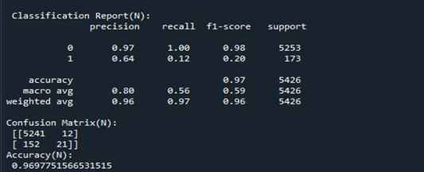
  
  Accuracy when **K=10;
Accuracy = 96.36%**

  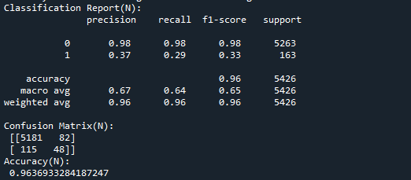
  
  From the above results, we can conclude that the value of K is causing fluctuation in the accuracy of the model.
Having K= 3, might cause overfitting and with K=10 we are getting different accuracy. When K = 10, the overfitting problem goes away for this data set.

**LOFOImportance plot using KNN:**

LOFO (Leave One Feature Out) Importance calculates the importance of a set of features based on a metric of choice, for a model of choice, by iteratively removing each feature from the set, and evaluating the performance of the model, with a validation scheme of choice, based on the chosen metric.

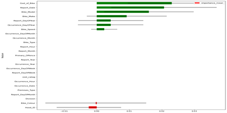

The last two features are red in colour which concludes that they have negative importance which hurts the performance of the model.

**Random Forest**
1) The random forest is a classification algorithm consisting of many decisions trees.
2) First, the model fits with training and testing data without ant tuning, and scores 98% which obviously is overfitting.

**Accuracy Before Tuning: 98.28%**

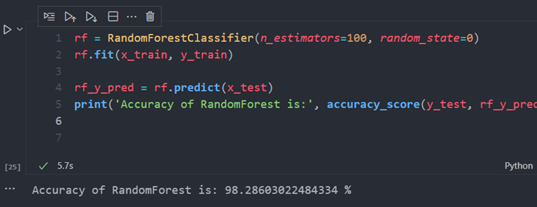

3) When the model fits on best parameters with tuning, it scores 97.93% accuracy. 

**Accuracy After Tuning: 97.93%**

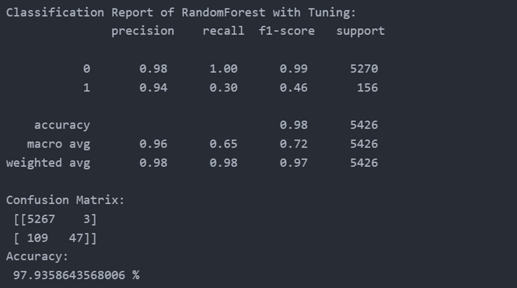

**Neural Network**

Accuracy when Hidden Layers is set to 5:

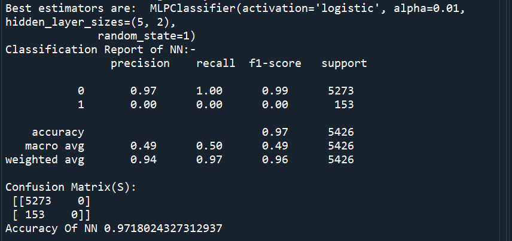

Accuracy when Hidden Layers is set to 3:

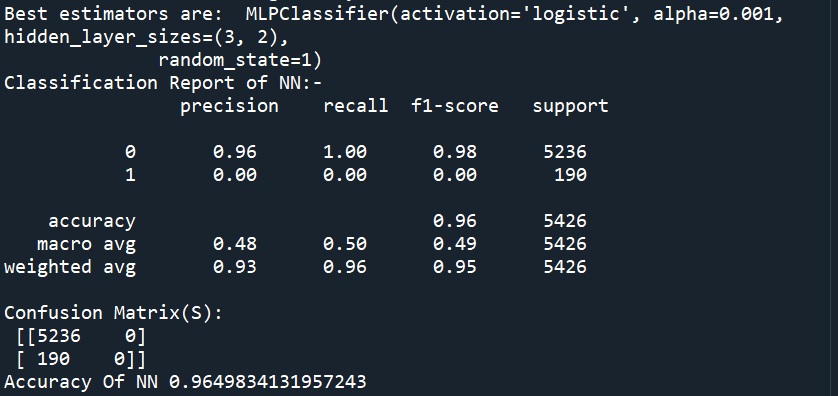

The accuracy is a bit overfitting when hidden layer was set to 5. Hidden layers are critical to the performance of neural networks, particularly in the case of complex problems where accuracy and time complexity are the primary constraints.

**Support Vector Machine**

1) SVM is one type of linear classifier. For two-class classification problems, finding a classifier is equivalent to finding a hyperplane that separates the data as well as possible.
2) In 2D the discriminant is a line and in 3D the discriminant is a plane,in nD it is a hyperplane.
3) The model fits data very well but linearly it is not possible to fit the data with more features. Therefore, model with linear kernel is showing the over fitting with 99% accuracy.
4)  The model works perfectly when we change the kernel type from linear to rbf and sigmoid. This clearly shows that when the dimension is increased it has become easy for model to separate the data and predict the output.
5) Also, fine tuning of the model can be done with the changing values of C and Gamma. Fine tuning the model with changing value of c will eventually tries to find wide margin. This process will take more time since the dataset has more features.

**Accuracy with RBF Kernel is = 96.39%**

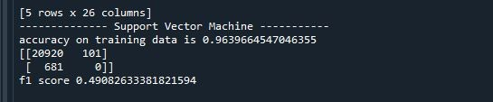

**Accuracy with Sigmoid Kernel is = 96.95%**

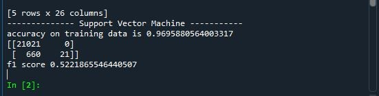

Logistic Regression

1) Logistic regression is a statistical analysis approach that uses independent characteristics to try to predict precise probability outcomes. On high-dimensional datasets, this may cause the model to be over-fit on the training set, overstating the accuracy of predictions on the training set, and so preventing the model from accurately predicting outcomes on the test set.
2) The below figure describes the accuracy of the model before the fine tuning.

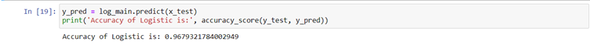

3) It can been clearly seen that model is overfitting the dataset as we are getting 96% of accuracy.
4) This is most common when the model is trained on a little amount of training data with a large number of features.
5) Also, Complex correlations are difficult to represent with logistic regression.
6) After fine tune the accuracy of model is as below, also here we can notice that there is no major change noted after fine tune. As the accuracy score is 97%.

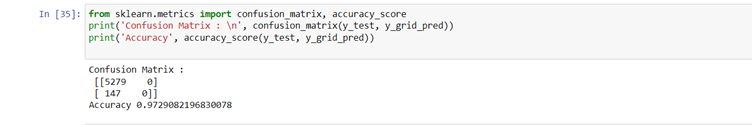

**Decision Tree**

Decision Trees (DTs) are a non-parametric supervised learning method used for classification and regression. The goal is to create a model that predicts the value of a target variable by learning simple decision rules inferred from the data features. A tree can be seen as a piecewise constant approximation.

**Accuracy Before Tuning is 99.79%**

**Accuracy After Tuning is 98.6%**

# Conclusion
Based on the above accuracy results, we are facing overfitting/underfittin issues with some of the models and with **K-nearest neighbour** we got 95% accuracy and it is varying with the value of K. Hereby, we can conclude that K-nearest neighbour is the best algorithm for given dataset. 

# Home Page

### 

# Prediction with model accuracy

